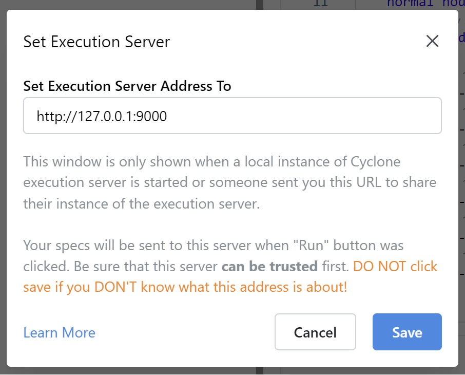
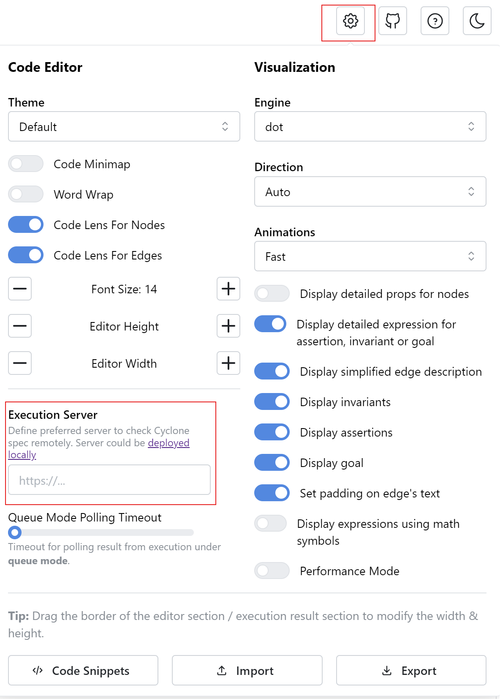

# Cyclone Execution Server (Rust Version)

A rust implementation of Cyclone Execution Server for [cyclone-online-editor](https://github.com/lucid-brndmg/cyclone-online-editor). 

## Introduction

The goal of this project is to provide a native, portable, easy to use and high performance version of the code execution agent for Cyclone to let users easily connect their local Cyclone instance to the [online code editor](https://cyclone.cs.nuim.ie). This server is compatible with most of the configuration specification of the [original Node.js version](https://github.com/lucid-brndmg/cyclone-online-editor#execution-server).

There are slight differences in server configurations (especially in `logger` section), which would be mentioned later. 

### Limitations
Currently, there's no plan to support [queue (async) mode execution](https://github.com/lucid-brndmg/cyclone-online-editor?tab=readme-ov-file#execution-modes).

## Usage

Download the latest version from release page, and start the server under the default configuration. To select a Cyclone instance, either put the binary file under Cyclone's root directory (where `cyclone.jar` locates), or manually select a `cyclone.jar` file after the file selection dialog popped up. 

### Connecting to Editor

Normally, after startup, a browser instance will be launched and a window would be popped to confirm the server address:



Click "Save" to connect to editor. Under certain situations, if the browser window didn't launch automatically, execution server can be manually set in settings menu of tutorial or editor page: 



### API

This project implemented server information `GET /` and synchronous execution `POST /exec` API that written in the [spec](https://github.com/lucid-brndmg/cyclone-online-editor?tab=readme-ov-file#implement-your-own-server).

### Configuration

Configuration of the server can be adjusted using command line, JSON file or `.env` file. During startup, the server will first (try to) load the JSON file, then read `.env` and environment variables, finally read the command line arguments.

#### Command Line Arguments

Some configuration options are available by using command line arguments. Use `--help` to see those options.

#### Config File

Similar to Node.js version, the configuration file is also written in JSON. By default, server will try to find `config.json` in the current directory (or `json` file specified in `-c`) and uses the default if not found or failed to parse.

Most of the fields are [compatible](https://github.com/lucid-brndmg/cyclone-online-editor?tab=readme-ov-file#configuration), while `queue`, `redis` are unavailable and `logger` uses a different configuration format:

```json5
{
  "cyclone": {
    // Cyclone executable file's location
    "path": "/path/to/cyclone/instance",
    // Cyclone executable file, used with cyclonePath
    "executable": "cyclone.jar",
    // The keyword in the execution result that indicates there is a trace generated
    // Modify this only when cyclone's output format has been changed in future versions
    "traceKeyword": "Trace Generated:",
    // Temporary directory that contains source code and trace files while running
    "sourcePath": "/path/to/tmp/files",
    // Should the sever or worker delete temp files immediately after each execution 
    // Might slow down performance, disable this and set queue.autoClearFileIntervalMs is recommended
    "deleteAfterExec": false,
    // Cyclone's extension
    "extension": ".cyclone",
    // Options that the server doesn't allow to set
    // Write WITHOUT "option-" prefix
    // These option might create additional meaningless files, not good in production
    "disabledOptions": ["debug", "log"],
    // A mandatory timeout for cyclone's execution in ms
    // Set this to 0 to disable this feature
    "mandatoryTimeoutMs": 10000,
    // Add cyclone.path into environment PATH temporarily when executing program
    // Recommended, otherwise cyclone.path should be manually set to PATH
    "appendEnvPath": true,
    // the length of each request id
    // depends on the amount of users
    "idLength": 8,
    // If true, system paths (i.e: /usr/local/.../id.cyclone) would be replaced to <censored-path> in both result and trace in the response
    // Recommended in production for security reasons (knowing the server's real path is dangerous, unless deployed locally for debug)
    "censorSystemPaths": true,
    
    // --- Extended Fields (only available at this implementation) ---
    
    // Prevent the server opening external GUI or web pages at startup
    // recommended at server deployment
    "silenceMode": false,
    // completely disable syntax checking for each execution request
    // recommended at local testings
    "disableSyntaxCheck": false
  },
  
  // Server configurations
  "server": {
    // server host and port
    "host": "127.0.0.1",
    "port": 9000
  },
  
  // logger config which has significant DIFFERENCES with Node.js version
  // This project uses a simpler format for config
  "logger": {
    // trace | debug | info | warn | error
    "level": "info",
    // log to console (stdout / stderr)
    "console": true,
    // log file directory
    // default is current
    // leave empty to stop writing log files
    "directory": ".",
    // log rotation: minutely | hourly | daily | never
    // default is never
    "rotation": "never",
    // log file prefix
    "filePrefix": "cyclone-exec-server",
    // disable ANSI colors in logging
    // suitable for Windows systems (cmd) and server deployment
    "noColor": false,
    
    // Series of regex patterns that for execution OUTPUT to match
    // If any rule matched the output, ONE log message would be generated reporting the details
    // Suitable for finding possible bugs in Cyclone instance
    // Similar to logger.execution.patterns of Node.js version
    // By default, this is empty
    "executionPatterns": [
      {
        // Optional name for this rule, 
        // will be appeared in the final message if matched
        "name": "",
        // the regex pattern for catching execution OUTPUT
        // can be set to a package name such as this to notify when Cyclone crashed
        "re": "(\\s+\"org\\.nuim\\.cyclone)",
        // The log level for this rule
        // If any rule matched the output, a log will be output
        // using the MAX level of matched rules
        "level": "error",
        // If this rule matched, 
        // the file would be kept on disk for further examination
        "keepFile": false,
        // Make the log to print the execution output content
        "printOutput": false,
        // Make the log to print the input (.cyclone spec) content
        // The input could be very long (depends on user requests)
        "printInput": false
      }
    ]
  }
}
```

#### Environment Variable

This project supports overwriting configurations using environment variables and `.env`. [Similar to Node.js version](https://github.com/lucid-brndmg/cyclone-online-editor?tab=readme-ov-file#using-env-file), the public prefix for each key is `CYCLONE_ES` with differences in `logger` settings:

| `.env` Key                              | Config's Json path         |
|-----------------------------------------|----------------------------|
| CYCLONE_ES_CYCLONE_PATH                 | cyclone.path               |
| CYCLONE_ES_CYCLONE_EXECUTABLE           | cyclone.executable         |
| CYCLONE_ES_CYCLONE_APPEND_ENV           | cyclone.appendEnvPath      |
| CYCLONE_ES_CYCLONE_SOURCE_PATH          | cyclone.sourcePath         |
| CYCLONE_ES_CYCLONE_TIMEOUT_MS           | cyclone.mandatoryTimeoutMs |
| CYCLONE_ES_CYCLONE_ID_LENGTH            | cyclone.idLength           |
| CYCLONE_ES_CYCLONE_TRACE_KEYWORD        | cyclone.traceKeyword       |
| CYCLONE_ES_CYCLONE_DEL_AFTER_EXEC       | cyclone.deleteAfterExec    |
| CYCLONE_ES_CYCLONE_EXTENSION            | cyclone.extension          |
| CYCLONE_ES_CYCLONE_DISABLED_OPTIONS     | cyclone.disabledOptions    |
| CYCLONE_ES_CYCLONE_CENSOR_SYSTEM_PATHS  | cyclone.censorSystemPaths  |
| CYCLONE_ES_CYCLONE_DISABLE_SYNTAX_CHECK | cyclone.disableSyntaxCheck |
| CYCLONE_ES_CYCLONE_SILENCE_MODE         | cyclone.silenceMode        |
| CYCLONE_ES_SERVER_HOST                  | server.host                |
| CYCLONE_ES_SERVER_PORT                  | server.port                |
| CYCLONE_ES_LOGGER_CONSOLE               | logger.console             |
| CYCLONE_ES_LOGGER_LEVEL                 | logger.level               |
| CYCLONE_ES_LOGGER_DIRECTORY             | logger.directory           |
| CYCLONE_ES_LOGGER_ROTATION              | logger.rotation            |
| CYCLONE_ES_LOGGER_FILE_PREFIX           | logger.filePrefix          |
| CYCLONE_ES_LOGGER_NO_COLOR              | logger.noColor             |

### Deployment

The default configurations are made for users to use at a local environment. However, this server is also suitable for server deployment, but there's certain configurations worth mentioning:
- A timeout should be set to limit the maximum time of each execution
- Use silence mode `-s` to prevent opening any GUI dialogs or starting browsers at the beginning (those features are made for users, not servers)
- Use a specific directory to store temporary execution files (`.cyclone`, `.trace`, etc...) and use a strategy to clear temporary files.
- Censor system file paths at the execution output and trace, if the directories are sensitive.
- Always check for Cyclone syntax and disable certain Cyclone options that may create useless (for the server) files, for example: `debug`
- Disable logger's ANSI output using `--no-color`

## Developing

### Building From Source

To build this project from source, use:
```shell
cargo build --release
```

The default binary files are optimized with file size. To let rust optimize with speed, change `opt-level = "z"` to `s` in `Cargo.toml`.

### Cyclone Grammar Files

This project uses [antlr4rust](https://github.com/rrevenantt/antlr4rust) to parse and validate Cyclone specs at execution. To modify Cyclone grammar files, the first step is to download the [latest version of antlr4rust JAR file](https://github.com/rrevenantt/antlr4rust/releases/tag/antlr4-4.8-2-Rust0.3.0-beta). 

**NOTE:** This project uses 0.3.0-beta of antlr-rust, while its repository's [default release page](https://github.com/rrevenantt/antlr4rust) provides 0.2, which CANNOT be used in this project.

After modifying the grammar rules, use these commands to generate the lexer and parser source code:

```shell
java -jar /path/to/antlr-rust.jar -Dlanguage=Rust grammar/CycloneLexer.g4 -o src/parse

# remember to add the -visitor flag to generate visitor, which is used in this project
# DO NOT use -no-listener flag, see https://github.com/rrevenantt/antlr4rust/issues/86
java -jar /path/to/antlr-rust.jar -Dlanguage=Rust grammar/CycloneParser.g4 -o src/parse -visitor
```

The current grammar files are basically the same with [cyclone-analyzer](https://github.com/lucid-brndmg/cyclone-analyzer)'s with slight differences:

- Since ANTLR-RUST uses ANTLR 4.8, the `channel` feature was replaced to `skip` in lexer files, otherwise the specs would be failed to parse because of white spaces and comments
- A rule named `type` is conflicted with rust keyword, and it was renamed to `type_mark`

## Licence

Published under the [MIT license](https://tldrlegal.com/license/mit-license).